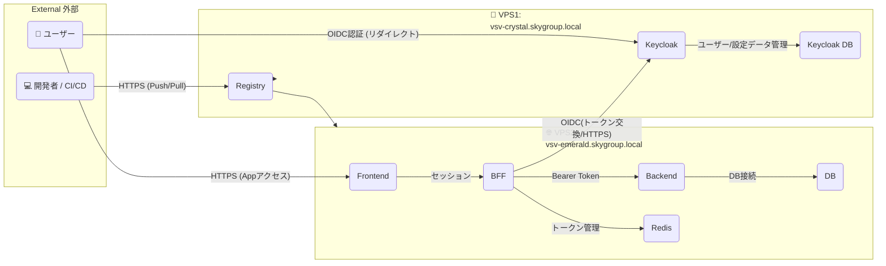
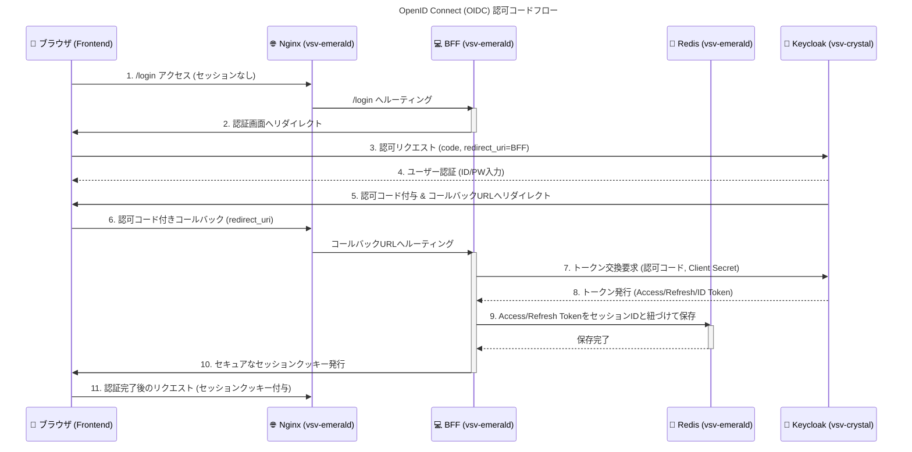
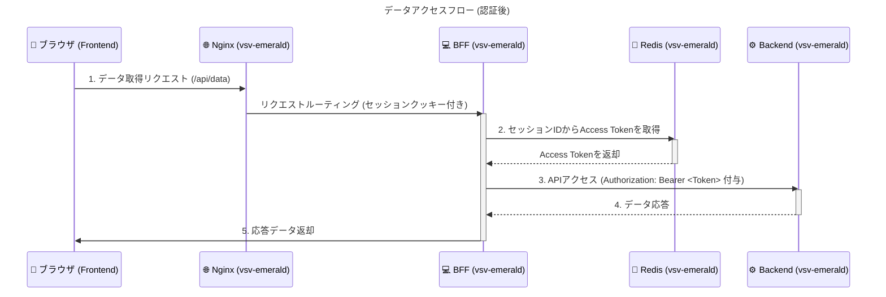

# 💻 Web アプリケーション構成概要 (VPS 2 台構成)

本システムは、機能分離とセキュリティ強化のため、役割の異なる **2 台の仮想プライベートサーバー (VPS)** を用いて構築されています。VPS1 は認証とイメージ管理、VPS2 はアプリケーション本体を実行します。

## 1. サーバー役割概要

| サーバー | ホスト名                     | 主な役割                                          | 接続方式               |
| :------- | :--------------------------- | :------------------------------------------------ | :--------------------- |
| **VPS1** | `vsv-crystal.skygroup.local` | **認証プロバイダー** および **Docker レジストリ** | **インターネット経由** |
| **VPS2** | `vsv-emerald.skygroup.local` | **Web アプリケーション本体** (実行環境)           | **インターネット経由** |

## 2. システムコンポーネント関係図

以下の図は、VPS1 と VPS2 の役割、内部コンポーネント、そして外部との依存関係を視覚的に示しています。

## 3. VPS1: 認証・レジストリサーバー (`vsv-crystal.skygroup.local`)

インフラのコア機能、特に**認証認可**と**デプロイに必要なイメージ管理**を担います。

- **コンテナ構成 (docker-compose)**
  - **`keycloak`**: **認証プロバイダー**。OpenID Connect (OIDC) プロトコルを提供。
  - **`keycloak_db`**: **Keycloak 専用のデータベース**。Keycloak が管理するユーザー情報、レルム設定、クライアント定義、セッション情報などを永続化するために利用されます。
  - **`registry`**: **Docker イメージレジストリ**。アプリケーションイメージの保管と配布。
- **通信窓口**
  - **`nginx`**: リバースプロキシとして機能し、外部からの **Keycloak への認証リクエスト**や **Registry へのイメージ Push/Pull アクセス** を適切なコンテナにルーティングします。

## 4. VPS2: Web アプリケーションサーバー (`vsv-emerald.skygroup.local`)

ユーザーに直接サービスを提供する、アプリケーションの実行環境です。

- **コンテナ構成**
  - **`nginx`**: 外部トラフィックを受け付け、主に `frontend` へのルーティングを行う**通信窓口**。
  - **`frontend`**: **ユーザーインターフェース (UI)** を提供。クライアント側での**セッション管理**を担当。
  - **`bff` (Backend For Frontend)**:
    - **認証ゲートウェイ**。VPS1 Keycloak とのトークン交換を行い、**アクセストークンとリフレッシュトークンを管理**します。
    - Frontend からのリクエストを検証し、Backend へ転送する際の**Bearer トークン付与**を担当します。
  - **`backend`**: アプリケーションの**メインビジネスロジック**を実行する API サービス。BFF からの有効なアクセストークンでのみアクセスを許可します。
  - **`redis`**: **BFF**が利用する**キャッシュ/データストア**。**アクセストークンとリフレッシュトークン**の保存・管理に使用されます。
  - **`db`**: アプリケーションデータの**永続化**を行うデータベース。

## 5. 認証・データアクセスフロー（Keycloak と BFF 連携）

本システムは、OIDC 認可コードフローと BFF を必須とするデータアクセスにより、機密性の高いトークンをクライアントに露出させないセキュアな設計を採用しています。

### 5-1. ユーザー認証フロー (OIDC Code Flow)

Keycloak と BFF が連携し、BFF 内の Redis にトークンを保存してセッションを確立するまでの流れをシーケンス図で示します。

---

### 5-2. データアクセスフロー

認証完了後、Frontend からのデータ取得リクエストが BFF を経由し、Redis に保存されたトークンを用いて Backend へセキュアにアクセスする流れをシーケンス図で示します。

